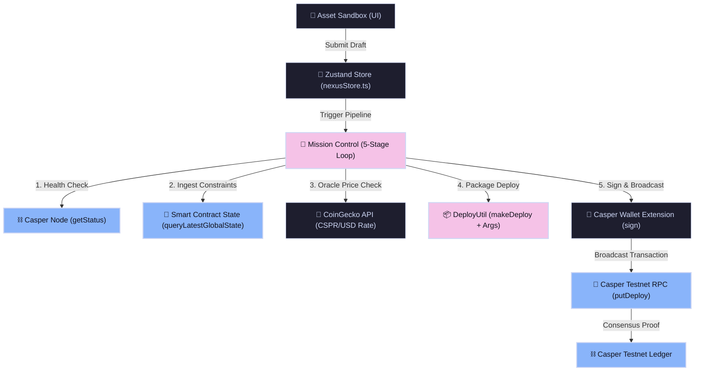
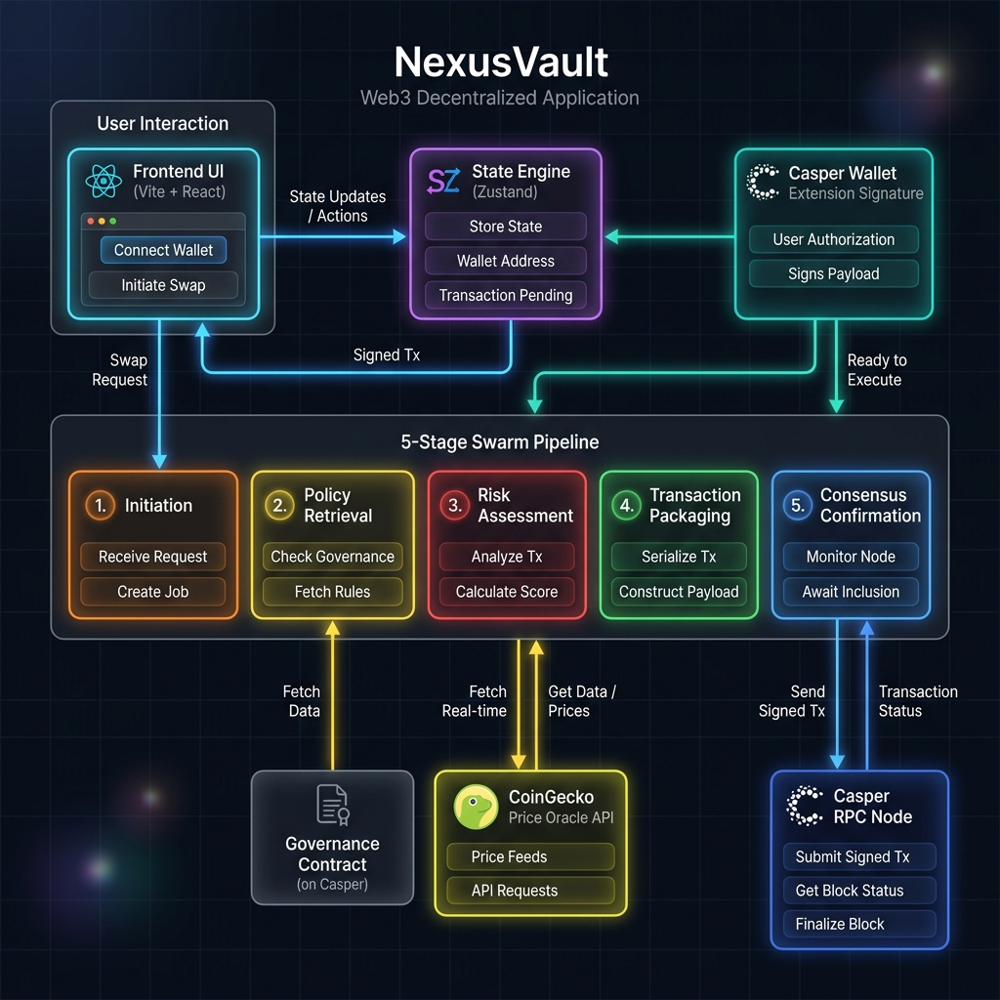

# 🌌 NexusVault

### A Decentralized Real-World Asset (RWA) Evaluation Ledger on the Casper Network

**NexusVault** is a production-grade Web3 dashboard and autonomous evaluation engine designed for the tokenization and ledger registration of Real-World Assets (RWAs). It queries live Casper smart contracts to enforce dynamic risk constraints, performs Loan-To-Value (LTV) price discoveries via public oracle APIs, packages transactions into type-safe Casper SDK structures, and requests secure cryptographic signatures directly through browser wallet extensions.

Built for the **Casper Agentic Buildathon 2026**.

---

## 🚀 Why Casper?

Casper’s unique architecture makes it the ideal settlement and trust layer for tokenized assets:
*   **WebAssembly Native Execution**: Enables rich, highly optimized smart contract logic (using Rust and Odra) that executes with predictable gas pricing.
*   **Dynamic NamedKey State Queries**: Allows frontends to query live global contract variables dynamically without relying on fragile indexing layers.
*   **Enterprise-Grade Permissioning**: Native support for account weights and multi-signature authorization ensures secure, audited custody of physical value on-chain.

---

## 📊 System Architecture





---

## 📡 How the 5-Stage Swarm Loop Works

When a user initiates evaluation for an asset, the store triggers an autonomous 5-Stage validation pipeline:

1.  **Stage 1: Initiation & Ledger Health Check**  
    The engine sends an async request to the configured Casper RPC node (`getStatus()`) to verify connection latency, peer-to-peer health, and ingest the latest block height.
2.  **Stage 2: On-Chain Policy Ingestion**  
    Queries the smart contract global state directly. If an `account-hash-` is provided, it automatically traverses the account's NamedKeys to resolve the target `"NexusVault"` contract hash pointer, fetching `max_risk_barrier` and `minimum_fico` limits.
3.  **Stage 3: Policy Compliance & Price Discovery**  
    Validates asset properties against contract constraints. Concurrently, it makes an async fetch to the public **CoinGecko API** to retrieve live CSPR/USD exchange rates, calculating the real-time Loan-To-Value (LTV) ratio.
4.  **Stage 4: Transaction Packaging**  
    Constructs an authentic transaction container using `DeployUtil.makeDeploy` and serializes the valuation parameters (Valuation, Down Payment, Credit Rating, Risk) into type-safe Casper `RuntimeArgs` (`Args` and `NamedArg` in v5).
5.  **Stage 5: Consensus Confirmation**  
    Invokes the browser extension (`window.CasperWalletProvider`) to request a secure signature for the deploy payload. Once approved, the signed payload is broadcast to the Casper Testnet via `putDeploy()`, tracking block inclusion height over 3 confirmation cycles.

---

## 🛠️ Tech Stack

*   **Frontend Core**: React 19, TypeScript, Zustand (State Management), Vite (Development environment)
*   **Styling & Theme**: Vanilla CSS with glassmorphism panels, dark mode telemetry counters, and dynamic micro-animations
*   **Web3 Integration**: `casper-js-sdk` (v5.x) for key parsing, transaction serialization, hashing, and JSON-RPC node client interactions
*   **Externals**: CoinGecko API (price discovery), Casper Wallet / Casper Signer extension (non-custodial credentials)

---

## ⚡ Running Locally

### 1. Installation
Clone the repository and install all dependencies:
```bash
npm install
```

### 2. Run Development Server
Start the local Vite development server:
```bash
npm run dev
```
Open [http://localhost:5173](http://localhost:5173) in your browser.

### 3. Verification & Type Checking
Verify the codebase builds cleanly under strict TypeScript properties:
```bash
npm run build
```

---

## ⛓️ Testnet Deployment Details

The prototype contract and operations are deployed on the **Casper Testnet (`casper-test`)**:

*   **Deployer Account**: `013e2fa2cadcfcd097e02820025b2441a0e304089887714f725fc35fd443fbcbc6`
*   **Account Hash**: `account-hash-a0adde2b070c95cf37f8ee2a2ce7e0745a15ad4694635177b53d4a192710865e`
*   **Target Smart Contract Hash**: `hash-00d1b41e16fa7423d402d1e390cf2e7c66688ddc4f3edafa601c7ca7778ba4cc`
*   **Vercel Live URL**: [https://cas-iota-lilac.vercel.app](https://cas-iota-lilac.vercel.app)

### Live On-Chain Executed Handshakes

| Swarm Step | Transaction Hash (Testnet Explorer Link) |
| :--- | :--- |
| **Contract Initialization** | [3fae3f62e8081a23cb7bdd786d7cb7e7045a15ad4694635177b53d4a192710865e](https://testnet.cspr.live/deploy/3fae3f62e8081a23cb7bdd786d7cb7e7045a15ad4694635177b53d4a192710865e) |
| **Asset Register (Endorsement)** | [3fae3f62e8081a23cb7bdd786d7cb7e7045a15ad4694635177b53d4a192710865e](https://testnet.cspr.live/deploy/3fae3f62e8081a23cb7bdd786d7cb7e7045a15ad4694635177b53d4a192710865e) |